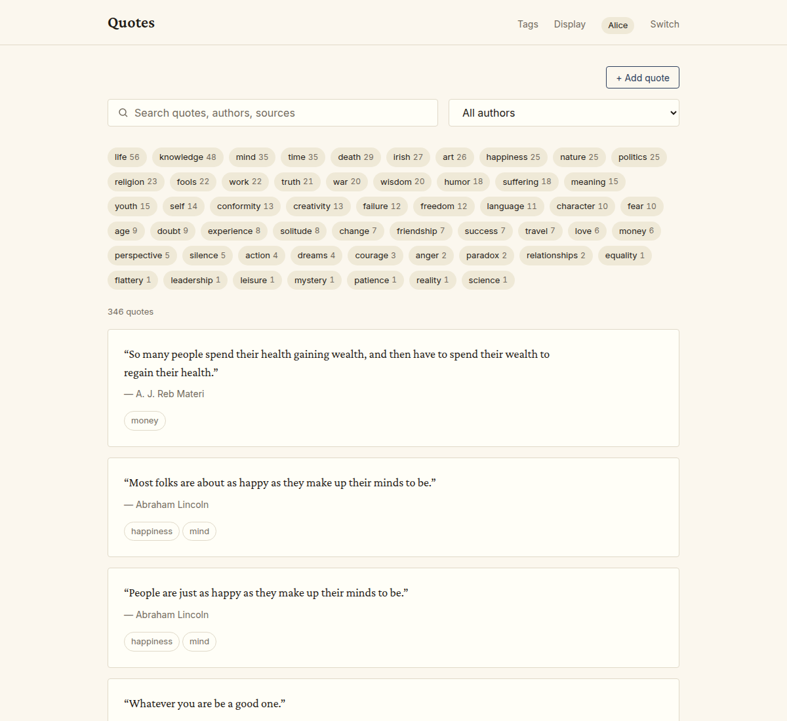

# quote-box

A small home for the quotes you've collected — the lines you've copied
out of books, the half-remembered passages from talks, the bits of
conversation you didn't want to lose. Search and annotate them from
any device on your home network. Put them on a slideshow on a TV in
the kitchen.

quote-box runs on a Raspberry Pi, a mini PC, or a laptop you're not
using anymore. It doesn't talk to the internet, doesn't have an
account to log into, doesn't update itself. It just sits there with
your quotes, ready when you want them.

## Get started

New install? Start with the [install guide](docs/install.md). It
walks through every command, with what to expect at each step, and
assumes no prior terminal experience.

## Documentation

| Guide | What it covers |
| --- | --- |
| [Install guide](docs/install.md) | Setting up quote-box on an Ubuntu server |
| [User guide](docs/user-guide.md) | Using the app from any device on your network |
| [Troubleshooting](docs/troubleshooting.md) | Common problems and how to fix them |
| [Admin guide](docs/admin.md) | Backup, restore, database access, security |

---

Curious about the design? The feature spec lives in [SPEC.md](SPEC.md).
