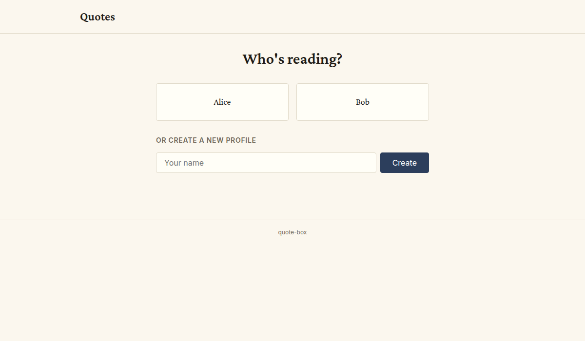
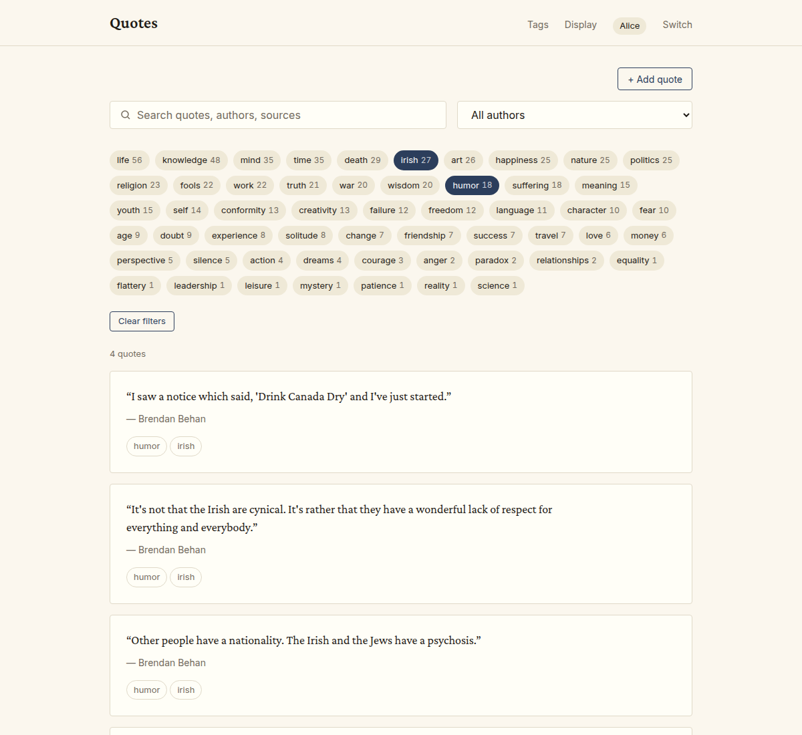
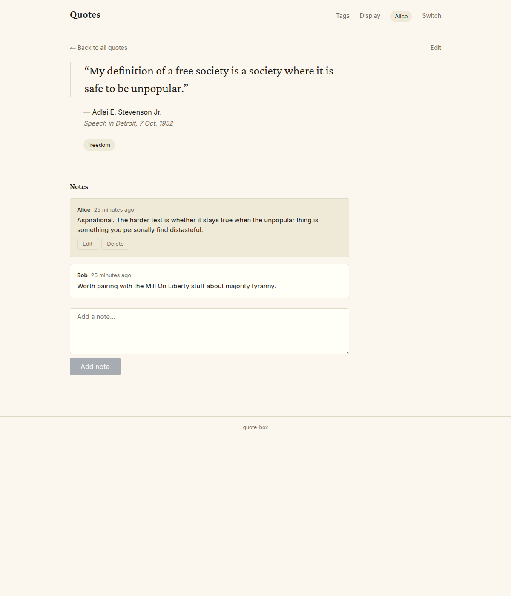
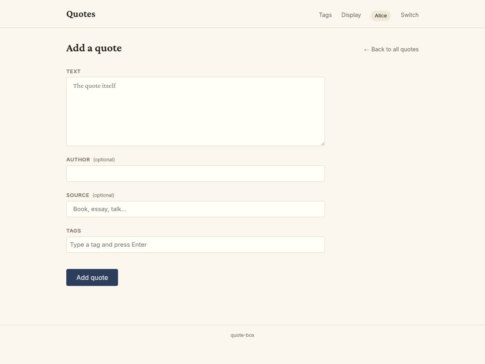
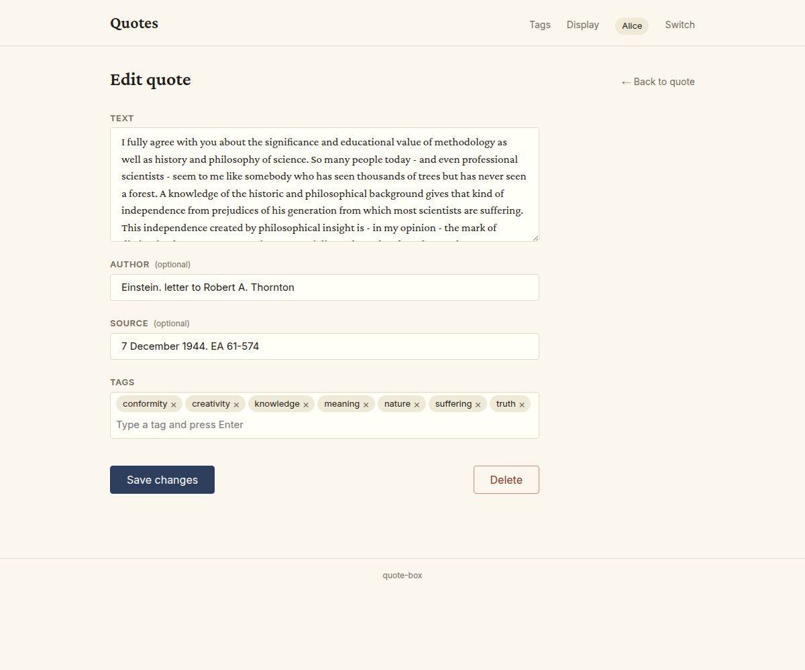
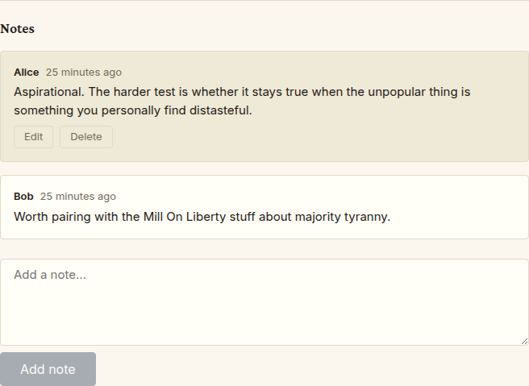
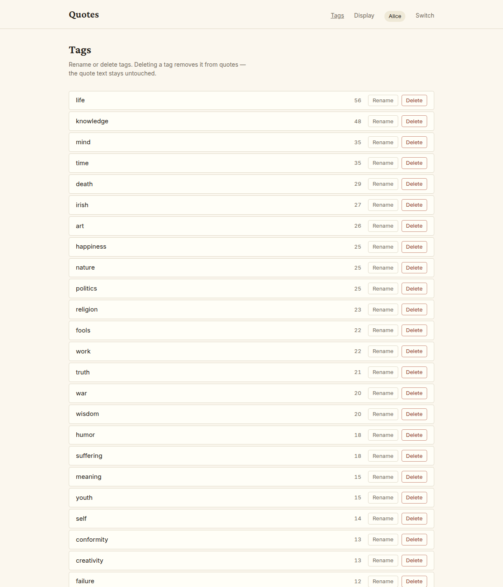

# Using quote-box

This guide walks through every screen of the app. Open quote-box in
a browser on your phone, tablet, or laptop and follow along. If you
haven't installed it yet, start with the [install guide](install.md).

The address looks like `http://your-server-ip:8035` — the same one
you used at the end of the install guide.

## Your first visit: pick a profile

The first time you open the app on a device, you'll see the **profile
picker**.



A profile is just a label. It lets the app remember which notes you
wrote when several people share the same library — kids, partner,
roommates. There are no passwords. Pick someone existing by tapping
their button, or type a new name and tap **Create**.

The app remembers your choice in a cookie on the device, so you
won't see this screen again on this device until you tap **Switch**
in the top-right corner.

## Browsing your quotes

After picking a profile, you land on the browse page — your whole
collection.


There are a few ways to narrow things down:

- **The search box** at the top filters as you type. It looks inside
  the quote text, the author's name, and the source.
- **The tag chips** are the small pills underneath. Each one is a
  topic — `wisdom`, `humor`, `death`, whatever you've assigned. Tap a
  chip to see only quotes with that tag. Tap it again to remove the
  filter. Tapping more than one combines them — you'll see quotes
  that have **all** the selected tags.
- **The author dropdown** lets you pick a single author. "All
  authors" shows everyone.
- The number underneath ("142 quotes") updates as you filter.



When any filter is active, a small **Clear filters** button appears.
Tap it to start over.

At the bottom of the list are **Prev** and **Next** buttons. Each
page shows fifty quotes. The current page number is shown between
the buttons.

Tap any quote card to open its full detail page.

## Reading a quote

The detail page shows one quote at a time, larger and with more room
to breathe.



You'll see:

- The quote itself, in big serif type
- The author (if there is one) and the source (if there is one)
- The tag chips, each one a link — tap any tag to jump back to the
  browse page filtered to that tag
- The **Notes** section, where you and the others sharing this
  library can add personal reactions

## Adding a quote

When you come across a great quote and want to capture it, tap the
**+ Add quote** button in the top-right corner of the browse page.



The form has four fields:

- **Text** — the quote itself. Required.
- **Author** — who said it. Optional. As you type, the app suggests
  authors already in your library so you don't accidentally create
  "Voltaire" and "voltaire" as two separate people.
- **Source** — where it's from (book, essay, talk). Optional.
- **Tags** — type a topic and press **Enter** or **comma** to add it
  as a chip. Type again for more. Tap the **×** on a chip to remove
  it. The app suggests existing tags as you type. New tags are
  created automatically the first time you use them.

Tap **Add quote** at the bottom. The new quote opens up on its
detail page, ready for you to add a note.

## Editing or deleting a quote

On any quote's detail page, there's an **Edit** link in the
top-right corner. Tap it to get the same form, prefilled.



Change whatever you want and tap **Save changes**. The quote's web
address stays the same even if you change the text or the author —
links to it from notes or bookmarks keep working.

To remove a quote permanently, tap the **Delete** button at the
bottom of the edit form. You'll get a confirmation prompt; **once a
quote is deleted, it can't be recovered through the app**. (If you
have a recent backup, the [admin guide](admin.md#restoring) covers
restoring it.)

## Adding notes to a quote

Notes are your personal reactions to a quote — what it reminded
you of, where you encountered it, why it landed.



A few things to know:

- Notes are visible to everyone using your library. The app is
  designed for collaborative annotation on a home network.
- You can only edit or delete **your own** notes — the ones written
  under your profile. Others' notes show up alongside yours but
  without edit or delete buttons; you can read them but not change
  them.
- The form at the bottom of the notes section is for adding a new
  note. Type, then tap **Add note**.
- On your own notes, the **Edit** button swaps the note text for a
  text box; **Save** commits the change, **Cancel** reverts.
- The **Delete** button asks "Delete this note?" — tap OK to remove
  it.

Times show as "just now", "5 minutes ago", "2 days ago". Hover
(or long-press on a touchscreen) for the exact time.

## Switching profiles

The top-right corner shows your current profile name and a **Switch**
link.

Tap **Switch** to forget your current profile on this device. You'll
land back on the profile picker, where you can pick someone else or
create a new profile.

The other profiles still exist — switching just changes who you're
acting as on this device.

## Managing tags

The **Tags** link in the top-right of the nav opens the tag manager.



Tags are listed with their counts (how many quotes use each one),
biggest first.

- **Rename** swaps the tag's name across every quote that uses it.
  Tap **Rename**, type the new name, press **Enter** (or click
  outside the box) to save, **Escape** to cancel. If the new name
  collides with an existing tag, you'll see an error and the
  original name comes back.
- **Delete** removes the tag from every quote that uses it. The
  confirmation prompt tells you exactly how many quotes will lose
  the tag and reminds you that **the quote text itself is unchanged**
  — only the tag association goes away.

## The display mode

quote-box can run as a slideshow on a TV, monitor, or any always-on
screen. Open this URL in a browser:

```
http://your-server-ip:8035/display
```

A quote fades in, sits for a while, then fades to the next. The
browser keeps the screen awake (most of the time — see "Wake lock"
below).


### Controls

Move the mouse (or tap once on a touchscreen) and a control panel
appears at the bottom. It hides again after three seconds of no
movement.

- **‹** — previous quote
- **||** — pause (or **▶** to resume)
- **›** — next quote
- **[ ]** — toggle fullscreen
- **slider** — how many seconds between quotes (5 to 120)
- **←** — back to the main app

### Keyboard shortcuts

These work whether the controls are visible or not:

- **Space** — pause / resume
- **← →** — previous / next
- **F** — toggle fullscreen
- **Esc** — exit fullscreen

### URL options for kiosk use

You can shape the slideshow by adding parameters to the URL. Each
one is added to the address with a `?` for the first one and `&` for
any after that.

- `?duration=30` — show each quote for 30 seconds instead of 20
- `?author=Voltaire` — only show quotes by Voltaire
- `?tags=irish,humor` — only show quotes tagged `irish` or `humor`
  (any of them, not all)
- `?show_tags=1` — render the tag pills below each quote
- `?nocontrols=1` — never show the control panel, even on mouse
  movement (true kiosk mode)

A full example for a kitchen TV that rotates Irish humor every
fifteen seconds with the tag pills visible and no UI clutter:

```
http://your-server-ip:8035/display?duration=15&tags=irish,humor&show_tags=1&nocontrols=1
```

### Wake lock

When the browser is the foreground tab and supports the modern
**Screen Wake Lock** feature, the screen stays awake automatically.
On older browsers, or in some cases on Linux desktops, you may need
to disable screen sleep in your operating system's settings for the
slideshow to keep running unattended.

## Using quote-box on your phone

Everything works on a phone. The filter controls stack vertically on
narrow screens, the quote cards become a single column, and tap
targets are sized for thumbs. The add-quote form is particularly
useful on a phone — when you stumble across a good line in a book or
podcast, you can capture it on the spot.

If something looks broken or you can't reach the app from your phone
when you can from another device, the
[troubleshooting guide](troubleshooting.md) has the common fixes.
